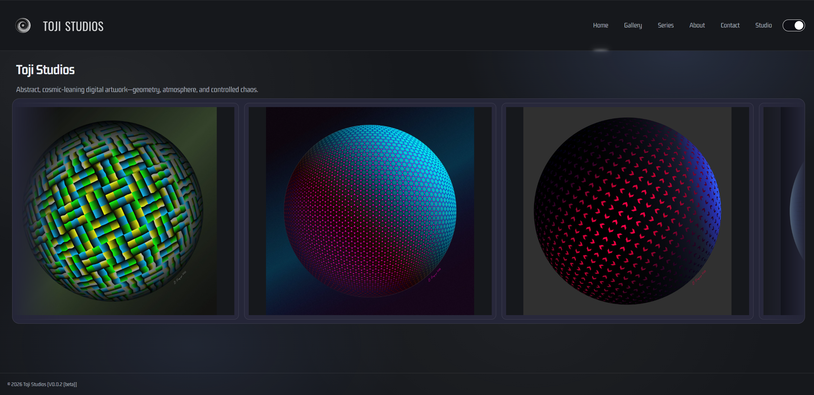
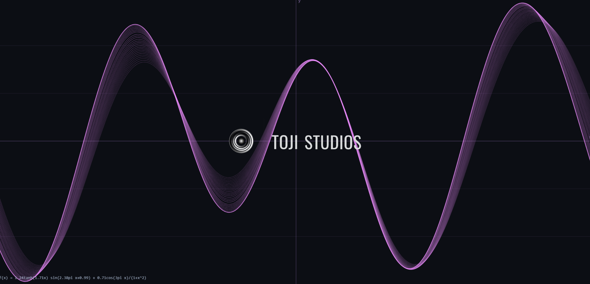
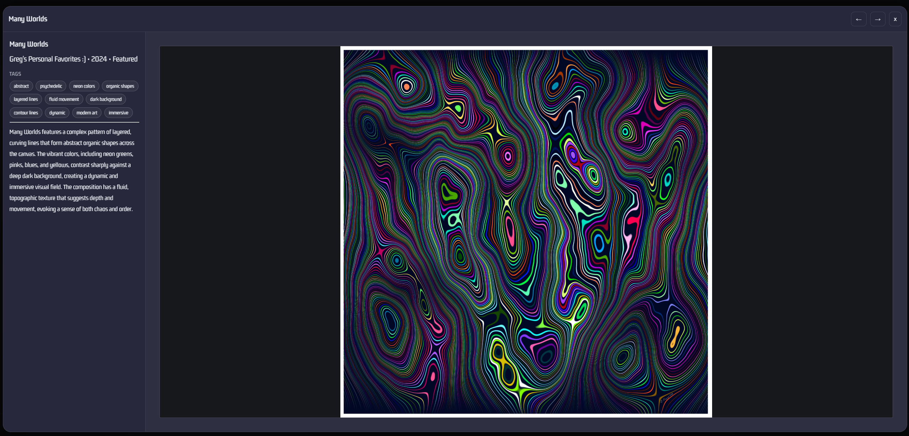
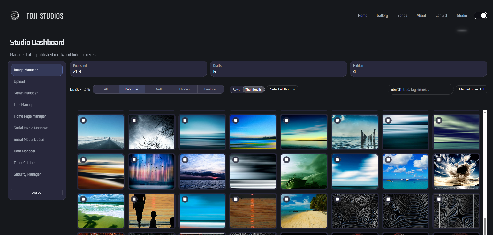

# Toji Studios Website

Toji Studios Website is a combined public site and admin studio application for managing and publishing digital artwork.

The project includes:

- a public-facing website with Home, Gallery, Series, About, Contact, and Artwork pages
- an admin interface for artwork management, uploads, series management, homepage settings, social publishing, data management, and other site settings
- a Node.js/Express backend that serves the site, exposes the API, manages uploads, and persists data in SQLite-backed storage

## Some Screen Shots










## Project Structure

```text
V1/
|-- public/
|   |-- admin/               # Admin HTML pages, page-specific CSS, and controllers
|   |-- assets/              # Shared CSS, JS, images, icons, and sample data
|   |-- server/              # Express API, tests, build script, and backend package.json
|   |-- index.html           # Public home page
|   |-- gallery.html         # Public gallery page
|   |-- series.html          # Public series page
|   |-- about.html           # Public about page
|   |-- contact.html         # Public contact page
|   `-- artwork.html         # Public single-artwork page
|-- run.bat                  # Starts the backend dev server
|-- test.bat                 # Runs the backend test suite
|-- deploy.bat               # Builds a deployment bundle
`-- build-and-deploy.md      # Detailed deployment notes
```

## Current Stack

- Frontend: static HTML, CSS, and vanilla JavaScript modules
- Backend: Node.js + Express
- Database: SQLite via `better-sqlite3`
- Image pipeline: `sharp`
- Security / transport helpers: `helmet`, `cors`

## Main Features

### Public Site

- splash screen and animated logo experience
- gallery browsing and series browsing
- artwork detail pages and lightbox viewing
- contact page with external links and contact settings
- shared public header and footer components

### Admin Studio

Available admin pages currently include:

- `Image Manager`
- `Upload`
- `Series Manager`
- `Link Manager`
- `Home Page Manager`
- `Social Media Manager`
- `Social Media Queue`
- `Data Manager`
- `Other Settings`
- `Security Manager`

Common admin tasks include:

- upload and publish artwork
- manage image variants
- edit series metadata and cover artwork
- manage splash and banner logo behavior
- manage homepage visibility and layout sections
- configure social platforms and queue/publish content
- export and import site data

## Requirements

- Node.js 20 or 22
- npm
- Windows PowerShell for the provided helper scripts and deployment script

## Getting Started

### 1. Install dependencies

```powershell
cd public\server
npm ci
```

### 2. Create your environment file

Use:

- [public/server/.env-EXAMPLE](public/server/.env-EXAMPLE)

Copy it to:

- `public/server/.env`

Then update the values for your environment.

### 3. Start the app

From the repo root:

```powershell
.\run.bat
```

Or directly:

```powershell
cd public\server
npm run dev
```

By default the server runs on:

- `http://localhost:5179`

Health check:

- `http://localhost:5179/api/health`

## Environment Variables

The backend loads configuration from `public/server/.env`.

Important variables include:

- `PORT`
- `ADMIN_PASSWORD`
- `ADMIN_TOKEN`
- `ADMIN_SESSION_TTL_HOURS`
- `PUBLIC_SITE_VERSION`
- `CORS_ORIGIN`
- `TOJI_STORAGE_DIR`
- `TOJI_SITE_DIR`
- `OPENAI_API_KEY`
- `OPENAI_IMAGE_DESCRIPTION_MODEL`
- `OPENAI_IMAGE_DESCRIPTION_MAX_TOKENS`
- `OPENAI_IMAGE_TAGS_MODEL`
- `OPENAI_IMAGE_TAGS_MAX_TOKENS`
- `BLUESKY_PDS_URL`
- `LINKEDIN_API_BASE_URL`
- `LINKEDIN_API_VERSION`

Notes:

- `PUBLIC_SITE_VERSION` is currently what the footer version API returns
- `TOJI_STORAGE_DIR` should point to persistent storage outside the deployment bundle in production
- `TOJI_SITE_DIR` can be used to explicitly point the server at the site root, though the server can auto-detect it in the normal deployment layout
- keep secrets such as `ADMIN_TOKEN`, `ADMIN_PASSWORD`, and `OPENAI_API_KEY` out of source control

## How It Runs

The server entry point is:

- [public/server/src/server.js](public/server/src/server.js)

The Express app currently:

- serves `/api/*`
- serves `/media/*`
- serves the static site from the resolved site root
- supports direct admin page routes like `/admin/OtherSettings`

Key backend route groups:

- `public/server/src/routes/public.js`
- `public/server/src/routes/admin.js`
- `public/server/src/routes/admin-session.js`
- `public/server/src/routes/upload.js`
- `public/server/src/routes/series.js`

## Development Notes

- Public pages live under `public/*.html`
- Admin pages live under `public/admin/*.html`
- Shared frontend behavior mostly lives in `public/assets/js`
- Shared styling mostly lives in `public/assets/css/site.css`
- Backend tests live under `public/server/test`

This project uses a lot of page-specific modules rather than a framework build system, so changes are often made directly in:

- HTML page files
- page-specific JS modules
- shared CSS and JS under `public/assets`

## Running Tests

From the repo root:

```powershell
.\test.bat
```

Or directly:

```powershell
cd public\server
npm run test
```

The backend package currently runs a broad Node test suite covering:

- auth
- sessions
- uploads
- admin UI controllers/utilities
- content routes
- AI routes
- social publishing routes
- data import/export routes
- CORS behavior

## Build and Deployment

To build a deployment bundle from the repo root:

```powershell
.\deploy.bat
```

Or:

```powershell
cd public\server
npm run deploy:build
```

This runs:

- [public/server/scripts/build-deploy-dist.ps1](public/server/scripts/build-deploy-dist.ps1)

Build output is written to:

- `public/server/dist`

The deployment bundle contains:

- backend runtime files
- package files
- the public site under `dist/site`

For full deployment details, see:

- [build-and-deploy.md](build-and-deploy.md)

## Suggested Workflow

1. Install dependencies in `public/server`
2. Create and configure `public/server/.env`
3. Run `.\run.bat`
4. Make frontend or backend changes
5. Run `.\test.bat`
6. Build with `.\deploy.bat` when preparing a deployment

## Repository Notes

- The active application lives in `public/` and `public/server/`
- The site and backend are designed to deploy together as one Node.js application
- Some settings are API-backed, while others still use browser storage for local admin/runtime behavior

## License / Ownership

This repository appears to be a private project for Toji Studios. Add your preferred license text here if you want to formalize reuse terms.
